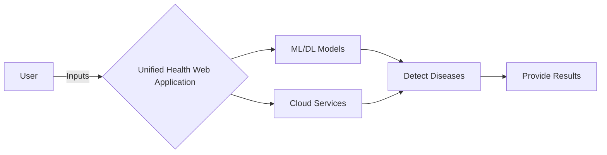

# Unified Health Web Application

## Introduction
This repository contains the research paper, resources, and codebase for the Unified Health Web Application. The application aims to detect various diseases such as cancer, Parkinson's, tumors, etc., using machine learning (ML) and deep learning (DL) models. It also incorporates cloud services and technologies to assist in the project.

## Research Paper
The research paper detailing the Unified Health Web Application can be found [here](https://docs.google.com/document/d/1k--KNaPu6_JHM5J707vgRmDX3rSuV65E/edit).

## Resources
Additional resources related to the Unified Health Web Application can be accessed [here](https://drive.google.com/drive/folders/1rY361mPLptkHDVRJkYMJ7gn1kOu4Avq6).

## SmartyPants

|Disease               |Category                        |Other                         |
|----------------|-------------------------------|-----------------------------|
|Cancer|`Brain | Breast | Lung | Skin`            |`Parkinson's'`            |
|Tumour          |`"Brain"`            |`-`            |
|Heart         |`Cardiovasculor`|`-`|

## UML Diagram

The UML diagram below illustrates the architecture and components of the Unified Health Web Application:



This diagram demonstrates how users interact with the application, which utilizes ML/DL models and cloud services to detect diseases and provide results.

## Instructions for Repository
To contribute to this repository, follow these steps:

1. Add all changes: `git add .`
2. Commit changes with a descriptive message: `git commit -m "commit message"`
3. Rename the main branch to 'main': `git branch -M main`
4. Link your repository to a remote origin (replace `<username>` with your GitHub username):
   ```
   git remote add origin https://github.com/<username>/unified-health-webapplication.git
   ```
5. Push changes to the main branch of the remote repository:
   ```
   git push -u origin main
   ```


app.py is the streamlit app code. run the command "pip install -r requirements.txt" to install the required dependencies for the streamlit app.

You may need to install additional libraries for running the jupyter notebooks.

## License
[MIT License](LICENSE)
